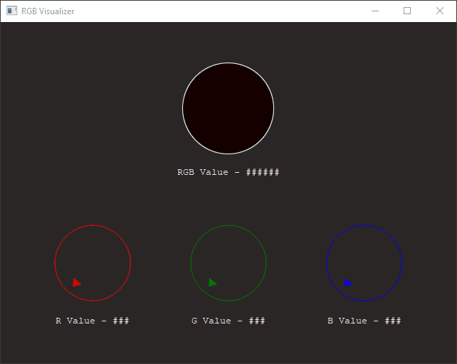

# RGBVisualizer
I have written this application to understand QML and Pyside2 (Signals and Slots)

## Running :
1. With Python (Signals and Slots used for communication with UI and Python)

        pip install pyside2
        python main.py

2. Windows (Created with Py2exe)

        output/main.exe

3. QML Standlone (Requires Qt)

        qmlscene RGBStandlone.qml

4. Running in Web Browser (QtWebGL - Single Client)

        python main.py -platform webgl:8080
        or
        qmlscene RGBStandlone.qml -platform webgl:8080

    

    
